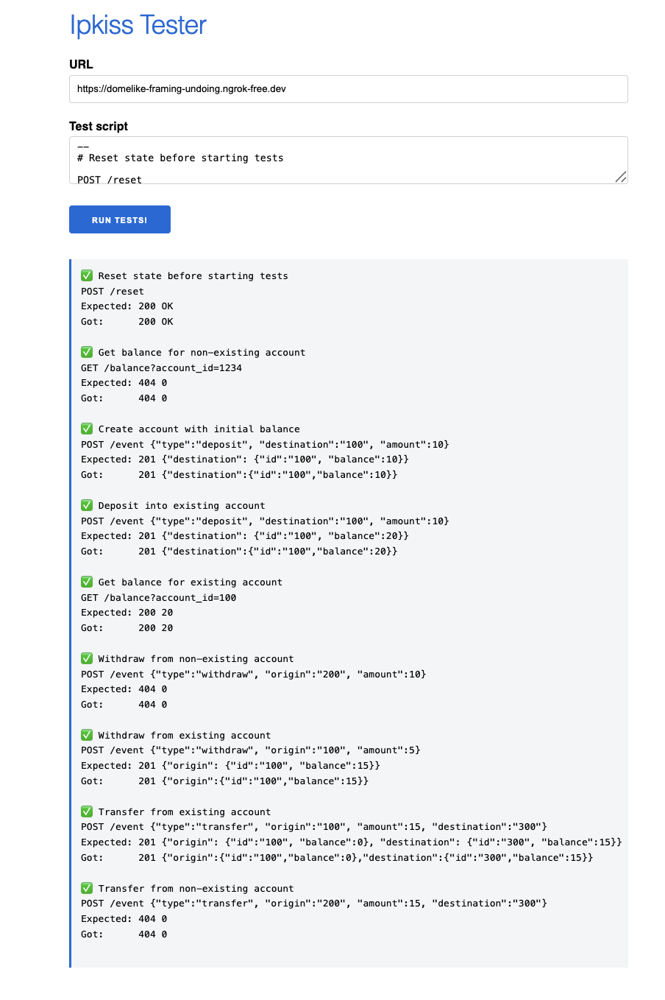

# Desafio EBANX

Projeto desenvolvido para o desafio técnico da EBANX, vaga Mid-level Software Engineer | Core Banking.

O projeto consiste numa API que simula operações bancárias básicas (depósito, saque, transferência e consulta de saldo) sobre um estado mantido em memória e exposto por HTTP.

Como o enunciado deixa claro que durabilidade dos dados não é necessária, assim como arquitetura e designs rebuscados, me mantive fiel a isso, sem utilizar banco de dados e nenhuma dependência que não fosse estritamente essencial. Inclusive, considerei adicionar OpenAPI para documentação com Swagger, mas decidi não fazer porque são três endpoints simples e o desafio pede explicitamente pra não trazer nada além do necessário e evitar over-engineering. Documentei os endpoints no README com exemplos de curl, que cobre o caso de uso. Em uma API real, com muitos endpoints e consumida por times diferentes, eu adicionaria Swagger sem pensar duas vezes.

## Stack do projeto

Como dito acima, bastante simples:

- Java 17
- Spring Boot 3.5
- Maven

Não usei banco de dados, cache, Lombok, nem nenhuma biblioteca alem das que já vêm com o Spring Web.
O estado vive em memória enquanto a aplicação está rodando, que é exatamente o que o desafio pede.

## Como rodar

Para subir a aplicação:

```bash
./mvnw spring-boot:run
```

A aplicação sobe na porta 8080.

Para rodar os testes:

```bash
./mvnw test
```

## Rodando com Docker 
Criei um Dockerfile no projeto para facilitar.

```bash
docker build -t ipkiss .
docker run -p 8080:8080 ipkiss
```

ou com Docker Compose:

```bash
docker compose up --build
```

## Endpoints

A API possui três endpoints:

| Método | Rota | Descrição |
| --- | --- | --- |
| POST | /reset | Zera todo o estado da aplicação |
| GET | /balance?account_id={id} | Consulta o saldo de uma conta |
| POST | /event | Aplica um evento: depósito, saque ou transferência |

O endpoint `/reset` não aparece na descrição original que recebi por e-mail, mas a suíte de testes oficial depende dele para começar cada execução com o estado limpo, então achei válido incluir.

### Exemplos

Depósito (cria a conta se ela não existir, ou soma ao saldo se já existir):

```bash
curl -X POST http://localhost:8080/event \
  -H "Content-Type: application/json" \
  -d '{"type":"deposit","destination":"100","amount":10}'
# 201 {"destination":{"id":"100","balance":10}}
```

Saque:

```bash
curl -X POST http://localhost:8080/event \
  -H "Content-Type: application/json" \
  -d '{"type":"withdraw","origin":"100","amount":5}'
# 201 {"origin":{"id":"100","balance":5}}
```

Transferência:

```bash
curl -X POST http://localhost:8080/event \
  -H "Content-Type: application/json" \
  -d '{"type":"transfer","origin":"100","amount":5,"destination":"300"}'
# 201 {"origin":{"id":"100","balance":0},"destination":{"id":"300","balance":5}}
```

Consulta de saldo:

```bash
curl "http://localhost:8080/balance?account_id=100"
# 200 0
```

Quando uma conta não existe (em consulta, saque ou transferência), a resposta é `404` com corpo `0`. Quando um saque ou transferência não tem saldo suficiente, a resposta é `422` com o saldo atual da conta.

## Estrutura do projeto

```
br.com.gabrieltiziano.ipkiss
├── web/                     camada HTTP
│   ├── BalanceController
│   ├── EventController
│   ├── ResetController
│   ├── dto/                 objetos de entrada e saída
│   └── exception/           tradução de erros para respostas HTTP
├── domain/                  regra de negócio
│   ├── model/               a entidade Account
│   ├── service/             os casos de uso
│   └── exception/           exceções de negócio
└── repository/              armazenamento
    ├── AccountRepository           contrato
    └── InMemoryAccountRepository   implementação em memória
```

A ideia é que cada camada tenha uma responsabilidade clara. Os controllers só traduzem HTTP para chamadas de serviço e de volta, os serviços contêm a lógica, o repositorio guarda os dados e a entidade `Account` protege o próprio saldo.

## Decisões técnicas

Algumas escolhas que merecem explicação, principalmente porque várias foram no sentido de não fazer mais do que o necessário, assim como pedia no enunciado do desafio:

### Por que não usei Clean Architecture
Minha ideia inicial era optar por esse padrão de arquitetura, mas como o projeto tem uma única entidade e três casos de uso bem simples sem nenhuma dependência externa (e o enunciado pedia para evitar arquiteturas rebuscadas), preferi simplificar. Se o sistema crescesse, com mais entidades e integrações, eu utilizaria.

### Estado em memória com ConcurrentHashMap
Como durabilidade não é requisito, o estado fica em um mapa em memória. Usei ConcurrentHashMap em vez de um HashMap comum porque o Spring atende requisições em paralelo com várias threads e um HashMap comum poderia vir a corromper a estrutura interna sob acesso concorrente. O ConcurrentHashMap evita esse risco sem que eu precise gerenciar locks manualmente para as operações simples.

### Repositório atrás de uma interface

O AccountRepository é uma interface, e a implementação em memória é só um detalhe. Fiz assim porque o enunciado pede um código fácil de modificar, e essa separação é o que permite trocar a implementação depois sem mexer na regra de negócio. Se em algum momento quisesse persistir em um banco, bastaria escrever uma nova implementação da interface.

### Operações de leitura e escrita atômicas

Depósito e saque seguem o padrão "ler, alterar, gravar", que sob concorrência pode perder atualizações se for feito em passos separados. Para evitar isso, expus um método **update** no repositório que usa o **compute** do ConcurrentHashMap, garantindo que a leitura e a escrita aconteçam de forma atômica para uma mesma conta.

A transferência é um caso especial porque mexe em duas contas ao mesmo tempo e precisa ser tudo ou nada. Resolvi com um bloco sincronizado dentro do serviço de transferência. Isso serializa apenas as transferências entre si, sem afetar depósitos e saques, e evita o risco de deadlock que existiria se eu tentasse travar duas contas separadamente. Em um cenário de produção com alta concorrência, eu trocaria por algo mais granular.

### A entidade protege o próprio saldo

A validação de saldo insuficiente fica dentro da Account, no método de saque, e não espalhada pelos services. A conta é quem sabe se pode ou não ter o saldo reduzido, então é ela quem rejeita a operação. Isso evita duplicar a regra em mais de um lugar e criar possíveis bugs que possam vir a aparcer no futuro.

### Saldo insuficiente responde 422

Quando um saque ou transferência falha por falta de saldo, a resposta é `422 Unprocessable Entity`, e não **400**. O **400** indicaria uma requisição malformada, mas nesse caso a requisição está perfeitamente válida: a conta existe, os campos estão certos e o que falha é uma regra de negócio, então o **422** é o status que descreve exatamente isso. A suíte oficial não testa esse cenário, mas o enunciado pede que o saque respeite o saldo, então implementei e tratei de forma coerente.

### Valores monetários como inteiros

Os valores são tratados como `int`. Em um sistema bancário real eu usaria algo como `BigDecimal` ou centavos em `long`, para evitar problemas de arredondamento. Aqui a suíte de testes trabalha só com inteiros e o enunciado não menciona moeda nem centavos, então adicionar precisão decimal seria antecipar um requisito que não existe.

### DTOs separados das entidades

O endpoint **event** recebe três tipos de corpo diferentes, distinguidos pelo campo **type**. Em vez de criar um endpoint para cada um ou um objeto único com todos os campos opcionais, modelei uma hierarquia com uma classe base e três subtipos, e deixei o Jackson escolher o tipo certo com base no **type**.

## Testes

Há dois níveis de teste no projeto.

Os testes unitários cobrem a entidade, o repositório e cada serviço de forma isolada, incluindo os caminhos de erro (conta inexistente, saldo insuficiente) e a garantia de que o estado não muda quando uma operação falha.

Há também um teste de integração que sobe a aplicação inteira e percorre o fluxo completo, das operações até a consulta de saldo, validando não só as respostas mas o efeito real no estado. Esse teste reproduz a mesma sequência da suíte oficial, mais um cenário de saldo insuficiente.

## Validação na suíte oficial

A aplicação foi testada contra a suíte automatizada em https://ipkiss.ebanx.ninja, expondo o ambiente local pela internet com o ngrok. Todos os casos passaram.



#### Desenvolvido por Gabriel Tiziano como desafio para a vaga Mid-level Software Engineer | Core Banking da EBANX.